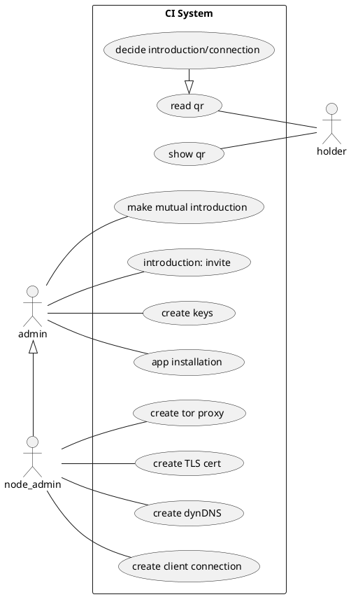
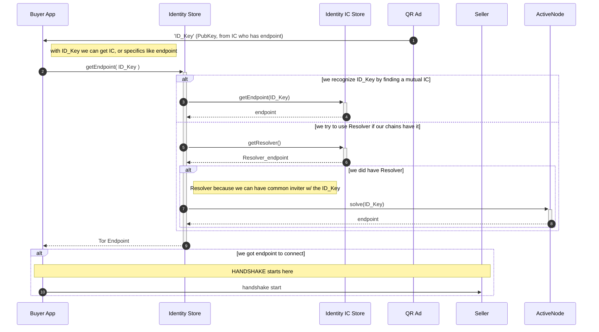

## Invitation Chain

This is the Invitation Chain. It is a Go package and a CLI tool for building
invitation and reputation chains. Later we might offer gRPC API as well.

### Design

1. use case driven approach.
1. test driven approach
1. algorithm first (PoC)
1. then input and output 
  - network transport
1. last the persistence 

## Use Cases

1. Install App and generate key pairs and secure enclaves
1. Meet a friend
    - check who has *trust-level* TL status TODO:
    - greater TL

### Use Case Explanations

#### Decide introduction/connection

If we have common invitations we could just connect and start chat. We can build
pairwise connection. However, if we already know each others well we can bind
our invitation chains together to make extra trust for our selves and our future
invitation-connections.

If we are reading QR code from ad aka sales pages and we know nothing about
other end, we must check our invitation chains. How we get invitation chain form
the QR code? The Tor address we are reading it from must be signed. This is very
important!

We don't want to contact QR-codes endpoint without knowing that it's valid! What
it means? We need QR-code resolving. And before we resolve the QR/code we need
to check if we can trust it. That happens thru our chains. If we don't have any
chains, we cannot connect to any ad, for example. That is incentive. 

DIDDoc resolving is cheap way to solve that issue, we don't want that, or do we?
Why DIDDoc resolving is so bad? For the most methods it requires that we contact
somewhere in the net to load DIDDoc!! It's bad. We want a method that allows us
make all the decisions before contacting anything, or maybe some sort of router,
we shall see. 

In our case it's easy, the endpoint is in our chains or it's not, that's for
that. Or we could have Nodes that work as resolvers, but let's go to that if
just have to, shall we?

Okay, we don't need to have the same keys as Tor but maybe it would make things
easier? Or interesting if we would have?

Business idea, those resolvers could make business, they could sell large
invitation chains to join with. And actually those parties who have many
connections are the most valuable if they give us high score. 

> It's cool that no one can stole the genesis block or reserve it for her self.

##### Handshake

What happens if the QR-code is the chain block that no one knows, i.e., we use
sub keys before we print the ad. Why we would do that if it makes our life more
difficult? NOTE! we use sub key only when we bind persistent pairwises between
parties. But maybe it's not enough? It might still be because ads can be
'general' and ads are just one block (pubkey), the rest of the chain is
transferred after
we connect to the endpoint associated to the pub key. Use next diagram to draw a
form handshake for ad sales.

(pub key : onion service address) -> connection, and start of the handshake.
We'll give our chain which is the chain that includes the (pub key). NOTE that
the position doesn't matter!! The handshake verification happens always towards
both parties leaf. This allows both parties to be pseudonym.

# References to PUML Works! Will use this in final.

