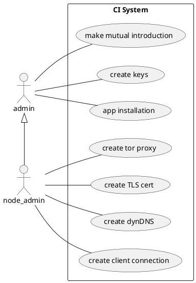
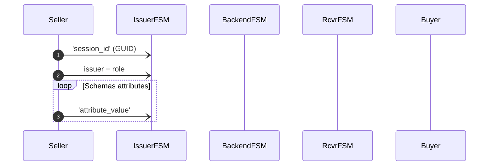

## Invitation Chain

This is the Invitation Chain. It is a Go package and a CLI tool for building
invitation and reputation chains. Later we might offer gRPC API as well.

### Design

1. use case driven approach.
1. test driven approach
1. algorithm first (PoC)
1. then input and output 
  - network transport
1. last the persistence 

## Use Cases

1. Install App and generate key pairs and secure enclaves
1. Meet a friend
    - check who has *trust-level* TL status TODO:
    - greater TL

# References to PUML Works! Will use this in final.

