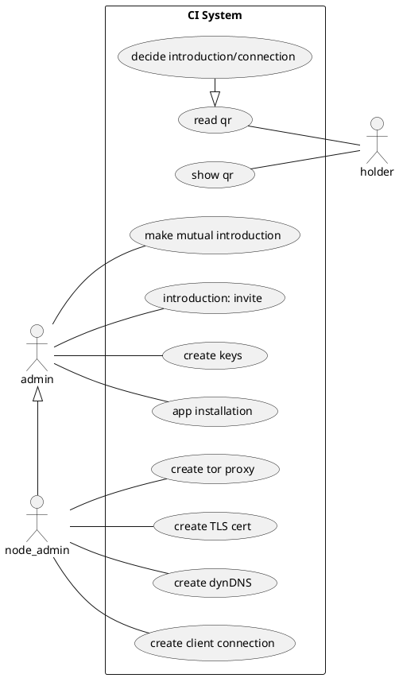
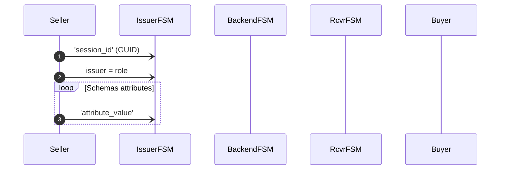

## Invitation Chain

This is the Invitation Chain. It is a Go package and a CLI tool for building
invitation and reputation chains. Later we might offer gRPC API as well.

### Design

1. use case driven approach.
1. test driven approach
1. algorithm first (PoC)
1. then input and output 
  - network transport
1. last the persistence 

## Use Cases

1. Install App and generate key pairs and secure enclaves
1. Meet a friend
    - check who has *trust-level* TL status TODO:
    - greater TL

### Use Case Explanations

#### Decide introduction/connection

If we have common invitations we could just connect and start chat. We can build
pairwise connection. However, if we already know each others well we can bind
our invitation chains together to make extra trust for our selves and our future
invitation-connections.

If we are reading QR code from ad aka sales pages and we know nothing about
other end, we must check our invitation chains. How we get invitation chain form
the QR code? The Tor address we are reading it from must be signed. This is very
important!

# References to PUML Works! Will use this in final.

