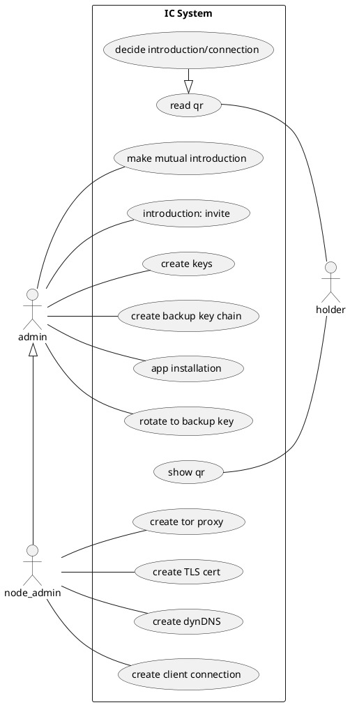
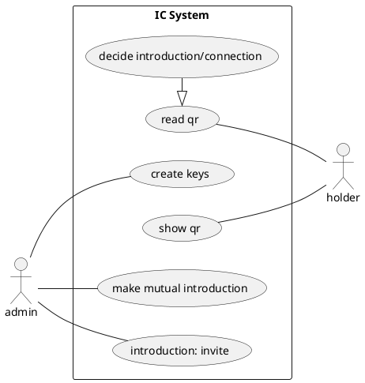
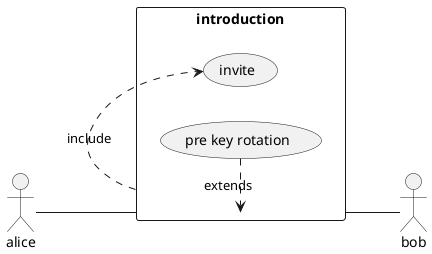
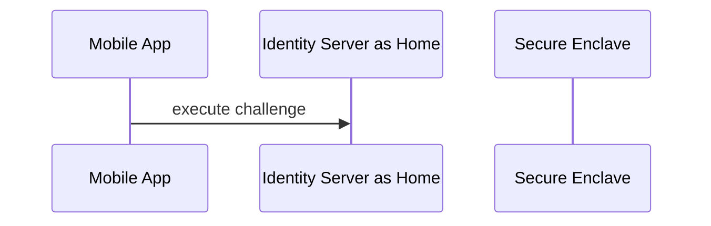
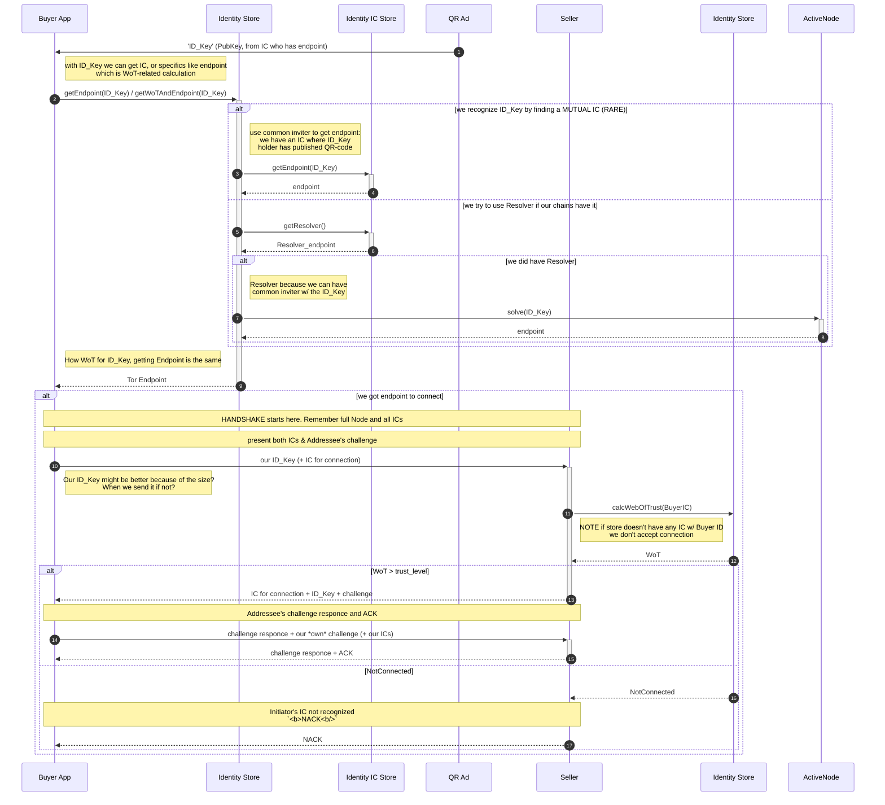

## Invitation Chain

This is the Invitation Chain. It is a Go package and a CLI tool for building
invitation and reputation chains. Later we might offer gRPC API as well.

### Design

1. Use case driven approach.
1. Test driven approach
1. Algorithm first (PoC)
1. Then input and output 
  - network transport
1. Last the persistence 
1. How about IC sync/update
    - we started by then Invitation/Introduction TX only and people could use
    that be "happy". But it's only history data which means that even when other
    people are connected to the same chain they don't get alerts of that.
    **But** do they even want those?? When they are invited and they share the
    same root, they are inside the trust-domain. Is that enough? What we are
    missing? So, everybody who are in the same chain are happy. (?). But when we
    allow new roots to be created, we might want to get information when some
    one who we know joins to new TD. Then our network would grow without doing
    any manual work.

    (?) Trust-domain key 
    (?) sub-key usage, when we are challenged, the other end accepts us to use
    master key.

# multi-layer key system

- master key
- sub keys
- to keep this stateless, transfer both
- how about if subkeys can be derived from the master-key without master-private
    - we don't need to sign anything
    - we don't need to communicate with (master) key holder
    = still we can verify that sub-key belongs to a certain master-key-public
        = key derivation (one way super fast, other way doesn't matter)

# Bring the exact acceptance rule


# the exact expiry/revocation rule.


### Atomic Problems We Want to Solve

- make similar to pairwise connections like `DID peer`, but
    - without MITM problem (DIDComm infamously have it, but it depends on DID
      method) or
    - without blockchain (ledger) or
    - trust registry
- use similar to VC (verified credentials, reputation, signatures) that can be
pinpoint to the original signature owner (VC is a good first phase, but maybe we
can find some kind of meta level behind issuing VCs).
- solve worlds oldest problem, have trust worthy communication channels without
3rd part's help (also meta level is interesting: smart contracts, payment
channels
- get rid of trust anchors in their current implementations like phone numbers,
emails addresses, etc.
- use existing technology that has proven acceptance record: FIDO2, and HW
tokens didn't break thru but passkeys seem to break

### Long-term Vision (maybe idealistic)

- remove surveillance
- remove correlation
- build 'new internet'
- solve need for trust delegation problem that use of really autonomous AI
agents bring
- move from age of platforms and centralization to symmetric internet
- make inter democratic again: solve DDoS, etc.

#### Trust-domain

What is the purpose of this? Why we want to create these? Why we won't use only
one domain? What is the root cause for these?

- *It was to solve the genesis problem!!* We thought that some real-world entity
must perform the on-boarding.
**But there are other ways to solve that!** 
1. We offer a system TD that preforms a KYC. We need a proper way to solve this
   and still maintain trust but perform everything with preserving anonymity.
    - Could this be a proof-of-work?
    - proof-of-stake? if we offer a way to join by adding a small fee, that
    would solve something.
    - and still KYC made by existing member would be free.
- **But** we could offer TD creation for those who wants to keep themselves
isolated from others. This would be like invitation-only chat room.

- TD & IC exists primarily because we wanted to solve the Issuer ID a pin-point
problem. If someone presents and VC we should be able to trust that it's
legitimate. We cannot do that if we cannot trust the domain.
- Our original idea was to have only one IC. Why to bring several? It was
because we thought that people cannot joint to system if there isn't no one to
invite you. But if we make one TD that's there and we offer.
- why this exists, why this is better that something else?
- If we can bring trust-roots ... TODO
- Can we solve this without code-signing?
- Can this solution still has a consensus problem?

## Use Cases 0

1. Alice is on-boarded to system
    - you can do this only once
    - you'll join to the IC 
    - you'll be KYCed, you'll be invited to the main chain!!
    - what happens if you don't want to join the main IC?
    - if you want to create new ICs you must *buy* or proof-of-work it
    - 
1. Bob is on-boarded to system
1. They want to introduce each others
    - this isn't nessassary if they are both part of the main IC
    - however, if time has went by, and they are part of other ICs they could
    - it enough that other is part of the IC
1. Let's assume that they both are part of the same IC. The main IC.
1. How another one can rotate keys?
    - if Bob has rotated his key, *but* they haven't need to introduce them
    selves, no problem.
    - **but** how we can avoid that Bob doesn't need to be KYCed once again?
        - if Bob was invited through his master-key he can rotate!
        - **if Bob looses control of his master-key** he loses his identity!
        - he should KYCed again to get his *new* master-key into the net
1. Pairwises are good because trust binds can be stored, which is good and
   allows key rotation. And it moves load from IC to where it should be.
    - PW protocol should allow key rotation
    - PW can be verified (second channel challenged) or not (allowed)
    - user decides what she do with unverified PW
    - PW needs to be set up on the first one-on-one communication
    - PW is set up with sub-keys
1. Invitation is done with a sub-key, but it's received to the master-key.
    - it's no use to be done with the master-key
        - it doesn't give any better trust level or anything.
        - you will be part of the IC any how
    - when you received the invitation to your MK you stay part of the IC as
    long as you don't compromise the master-key.
1. 

## Use Cases - New Trust-domain 

1. Trust-domain, can be work as a new invitation only where e.g. root can
   invite (not very good rule)
1. What other rules we could need?
1. Part of the secret society, sounds cool
1. Trust-domains can give you new opportunities, but with them we need more
   features to the app.

## Use Case == Verified Credentials, == reputation

1. We can trust that someone in our TD has gave the credit to someone
    - this is the major thing
    - someone could just give you a TX log. We made a deal, we are happy

## Use Case Categories

1. Dating apps
1. Messaging apps
1. AI apps
1. AI-Dating apps

## Use Cases

1. Install App and generate key pairs and secure enclaves
1. Make decision about the Trust Domain
    - do we need to start our own TD
    - do we just want to join to existing domain
    ```
    NOTE: moved to ID: tdc domain init # create a new empty identity ready to join/be invited

    tdc domain new # create a new trust domain maybe using POW
    ```
1. Create Identity
    Should we add flag `--trust-domain`
    ```
    tdc id new # create a new identity ready to join/be invited (only once)
    ```
    ```
    tdc id invite # create a new trust domain maybe using POW (? Human-readable HASH prefix
    tdc id join # invitation presented to us
    tdc id belong # list all the trust domains we are part of
    ```
1. Meet a friend
    - check who has *trust-level* TL status TODO:
    - greater TL


```plantuml
@startuml
left to right direction
skinparam packageStyle rectangle

actor holder
actor admin
actor node_admin

rectangle "IC System" {
  (show qr) -- holder
  (read qr) <|- (decide introduction/connection)
  (read qr) -- holder
  admin - (make mutual introduction)
  admin - (introduction: invite)
  admin - (create keys)
  ' (create keys) <|-right- (create backup key chain)
  admin - (create backup key chain)
  admin - (app installation)
  admin - (rotate to backup key)

  node_admin -- (create tor proxy)
  node_admin -- (create TLS cert)
  node_admin -- (create dynDNS)
  node_admin -- (create client connection)
}

admin <|- node_admin
@enduml
```


```plantuml
@startuml
left to right direction
skinparam packageStyle rectangle

actor holder
actor admin

rectangle "IC System" {
  (show qr) -- holder
  (read qr) <|- (decide introduction/connection)
  (read qr) -- holder
  admin -- (make mutual introduction)
  admin -- (introduction: invite)
  admin -right- (create keys)

}

@enduml
```


```plantuml
@startuml
left to right direction
skinparam packageStyle rectangle
actor alice
actor bob
rectangle introduction {
  alice -- (introduction)
  (introduction) .> (invite) : include
  (pre key rotation) .> (introduction) : extends
  (introduction) -- bob
}

@enduml``plantuml
```

### Terminology

| Technical | Problem Area Term |
|-----------|-------------------|
| IC        | Domain, makes it more powerful and meaningful: NewDomain! |
| Invite    | Join |

### Use Case Explanations

#### Create backup key chain & create keys

Backup keys will be used in catastrophes, i.e., we have lost our current IDK
pair. For instance, our FIDO HW token is lost or broken. How to prove our
identity in these situations. We cannot taken backups of the HW tokens. But we
should be able to register multiple tokens for our identity for these
situations.

> NOTE, key rotations are different actions and are done to, e.g., minimize
> correlation.

It seems that we should use our own authentication and secure enclaves in Black
Boxes (BB) because by that we could register multiple fido2 HW tokens and we would
have secure enclave backups in our own hand. Is it good or bad, we don't know
that yet.

It also seems that it would be good idea to have Web Wallet. That would we
possible if we had BB with web server and FIDO2 authentication. Actually we
could consider to use `passkeys` after testing it first. If we can still
register multiple authenticator it wouldn't be a problem.

#### Decide introduction/connection

If we have common invitations we could just connect and start chat. We can build
pairwise connection. However, if we already know each others well we can bind
our invitation chains together to make extra trust for our selves and our future
invitation-connections.

If we are reading QR code from ad aka sales pages and we know nothing about
other end, we must check our invitation chains. How we get invitation chain from
the QR code? *Solved*: Read on! We have our `digestive` for QR-code.

The Tor address we are reading it from must be signed. This is very
important! It is is solution.

We don't want to contact QR-codes endpoint without knowing that it's valid! What
it means? We need QR-code resolving. And before we resolve the QR code we need
to check if we can trust it. That happens thru our chains. 

> [NOTE!] **If we don't have any chains, we cannot connect to any ad. That is a
> general incentive to join the network!**

DIDDoc resolving is cheap way to solve that issue, we don't want that, or do we?
Why DIDDoc resolving is so bad? For the most methods it requires that we contact
somewhere in the net to load DIDDoc!! It's bad. We want a method that allows us
to make all the decisions before contacting anything, or maybe some sort of
router, we shall see. Yes, current idea is that the IC can include AN (Active
        Nodes) that offer generic services for it's members. All of the roots
must be that kind of services. However, if roots are proof-of-work proofed it
might the case that some other block in the chain is AN.

In our case it's easy, the endpoint is in our chains or it's not, that's for
that. Or we could have Nodes that work as resolvers, but let's go to that only
if we have to, shall we? 

> [INFO!] *We have to, because even when two parties belong to the same trust
> domain, i.e., they are in the same IC, other might join to the IC long after
> the other and then the 1st party cannot get second's endpoint. To solve that
> we're give root nodes, trust domain root responsible to work as a primary
> resolver. However, other nodes in the chain can work them as well.*

Okay, we don't need to have the same keys as Tor but maybe it would make things
easier? Or interesting if we would have?

Business idea, those resolvers could make business, they could sell large
invitation chains to join with. And actually those parties who have many
connections are the most valuable if they give us high score. 

> It's cool that no one can stole the genesis block or reserve it for her self.

##### Handshake

Current main steps for most difficult scenario:
1. We read other ends QR-code to be able to start communication, i.e., get
   *trusted* endpoint. TODO: what is that <-? Define later.
   - in the case we share the IC, the solution is trivial, we just read
   information form our IC that's already in our storage.
   - for the case we have WoT, we need to have full ICs (Nodes) from both
   parties, that leads to a problem, how we get other's Node information thru
   QR-code *before* we make connection to the endpoint? **NOTE** solution :
   qr-code includes root-IDKs (as many as we want to publish, we publish all
   because we have packed them as short digest, so the size isn't the limiting
   factor here).
1. We send our Node information which includes our IDK.
1. Other end checks WoT for our Node and theirs. If it exists and in limits
   they'll send their Node information to us.
1. We (optionally) recalculate WoT and if still OK, we'll continue TODO, why it
   wouldn't? It's better if they send more information to use. There is QR
   publishing party and there is connecting party. The connecting party makes
   it checks before hand and if it finds it OK or even possible then it
   connects. The QR party checks that we really share a IC.

> NOTE: Study if it's possible to calculate *Tor* Endpoint from a *Public Key*.
> If we have a public key, could we calculate a Tor endpoint from it? Key format
> is the same `ed25519`, but blinded public key is still open? "blinded public key",
> what it means? What is tor the hidden service directory? Daily-rotated
> identifier?

### Blinded Public Key

Important! We should use this instead of 
##### The authenticator model 

We have played with the master-key model and our own secure enclave. That's very
good solution for the backend, but could it be better if we would have
possibility to use FIDO2 HW tokens? We could study this and decide what it
needs. TODO.

> We should compare FIDO2 vs Passkey. Why the later was successful and the
> former didn't brake thru. The key point is that users don't want to make KMS
> by their selves. They want just that everything works, nothing else. So, let's
> think about everything through the Passkey, not FIDO2. Even though, we have
> been building previous implementations with FIDO2.

The straight forward way to move on is to use normal authentications scenario
where WebAuthn is only used to make HTTPS connection either for Web app or
Native app.

> [NOTE!] the great learning with the authenticators is the fact that we need to
> integrate call-home or push notification mechanism to the authenticator until
> it's totally safe. When we have that we can be sure that in every case the
> authentication challenge is sent to the right party with out MITM.

---


##### P2P networking

should we broadcast information to the network? Intuitive answer is: NO. Lazy
fetch is economical. Only contact when you need to!

###### Synchronization problem

How we are able to get the latest information when needed.
- Maybe root nodes should communicate between others?
- Should they be able to find each others? 
- Time problem comes up only when things happen cross domain, i.e., in
different trust domain. If new members are added to the same trust-domain, we
can always calculate trustworthy WoT figure, because we both are under the same
trust-domain root. However, if members are in the different trust-domains, but
they share common trust domain, it depends about order of the things or sync
mechanism that WoT can be calculated:
    1. Alice is a member of the Trust-domain America
    2. Bob is a member of the trust-domain Britain
    3. *These trust-domains are separated until something happens!*
    4. Bob introduce Carol into Britain trust-domain
    5. Alice introduce David into America trust-domain 
    6. *These trust-domains are still separated until something happens!*
    7. **Carol introduce David into Britain trust-domain** NOTE!
    8. Now Carol and David has become common links between these 2 trust-domains
    9. The question is that how we can tell this information effectively across
       the trust-domains? *The answer is*: the information must be send to the
       both trust-domain roots, because ??? **TODO** Define

#### TODO: how cross-domain information will be broadcast?

Should trust-domain roots introduce each others automatically? 

Pros:
Cons:

If trust-domain roots are going to know that there's a bridge between
trust-domains, how that information will be broadcast 

**This is a huge problem** 
Is this really? Trust domain roots don't know each others even their ancestor
do. The network grows in time. Maybe we should formalize that trust is always
between two nodes, not between TDs? It's practical versus formal. Or should it's
is what it is. Invitations happen between two nodes. Period. What happens
transitively, it happens. But two nodes doesn't know others. They know only
each others when introduction happens. when trust calculations happen, the
situation is different and the goal is different.

**Maybe the correct problem is trust update broadcasts** 
How we could broadcast meaningful information to the network when it's growing?
How we could do re-introductions, i.e., both parties might have new ICs when
they re-introduce each others later. But they have given those ICs to other
parties in the meanwhile. **but currently we don't use outbound ICs**. 


- *Nodes that belong n>1 trust domains are important because they are the points
where our network of networks grow.* **Shared Nodes** will be their name:
    - When n>1 networks are joined during the introduction, root domains should
    update their list of the trust domains.
    - root domain server will sync the list of trust domains
    - billion dollar question is that should those ancestors on boarded to all
    the trust domains where? We cannot, because all the introductions are done
    1on1. Period. However, it sill makes possible to let network grow because
    the time goes on and ICs grow than trust domains join. And we are part of
    them always. 

##### Should we have black lists?

Hopefully not. Let's keep the `introduction` safe so we don't need them.

> NOTE: Study from the code what is minimal information to calculate Endpoint.
> We need to find the current Active Node (AN) for the party who is the server:
> the party that Listen the network: the party who broadcasts information
> out to others to connect. Note that others must be able to trust at the
> minimal level the party who Listens . **How important this really is?** Do we
> think that other party can lie to us? What good it is when we anyhow have *handshake*
> after connection? The question is that should we try to help connecting party
> (client) to calculate trust (ASAP) before actual connection. Why? Fail faster?
> Endpoint as its current format and location is enough. The Client is blind if
> it cannot find the endpoint from its own records.
> **Answer**: 

> NOTE: Study from the code what is minimal information to calculate WoT.
> **Answer**: Both parties give full Nodes. **Corrected Answer:** It depends
> when this happens. We can calculate enough WoT info from ROOT IDKs, for
> example from the QR codes

> NOTE: Parties need invitations as high from the hierarchy as possible, which
> leads to centralization, **OR** everyone should avoid starting a new ICs. If
> we can avoid that we'll **have root ID that everyone recognize.** If offer
> that from cloud and everybody are free to span out their own *Active Node*
> whenever they need to. **That's the most important use case to solve next.**

### Peer-to-Peer networking is something that seems to be missing?

With p2p we could build live network like e.g. Bitcoin, ETH, etc. Where we have
background processes that transport data before that data is acutally needed or
should we try to build something that doesn't have that kind of feature, but
it's totally reactive network? What features we might need that reactive isn't
enough? If Active Nodes can work as proxies and relays for communication
channels. But why? Is this fare? We would have some kind of worker nodes? Maybe
they are needed if we bring some kind of push notification over network. But we
don't want SPAM, we want only pub/sub which is much more complex, I suppose.

#### How to build pub/sub network?

Nowadays we have 'join the group or chat room'. That sounds reasonable. Or it
sounds easy enough to start with, but something more sophisticated would be nice.

At least no one can shut this chat room system down, when servers are private.

## Data Containers to build Cloud/Home Wallets

Crypto is easy, but how about rest? **4 X TODO**

> NOTE: make a time sequence how those parties can re-read an ad's QR-code after
> failing first time for the lacking information either on their own IC storage
> or other's.
#### Answer (ad == can be web site, etc.)

## Invitation/Introduction Chain Based WoT System

**Concepts** 
- PW = pairwise connection
- IC = invitation chain, classical blockchain structure. A invites B: B receives
A's current IC with a new block where B's public key is stored to block and
previous block's hash is signed with A's key. Block includes all the needed
information like A's service endpoint(s).
- Oulu = a city in the Northern Finland
- MC = Motor Club
- TD = trust domain

**Principles** 
- Everything works offline if needed, but it isn't the core-principle, but
pseudonymity with trust is
- Everything is based on idea of secure, symmetric (duplex), 1-on-1 connections
where endpoints are called nodes
- Everything is based on the idea of self-certification 
- Nearest existing innovation is web-of-trust
- Tor's onion services is currently selected for transport layer to maintain
pseudonymity. Tor services listen endpoints and there is a so called platform
protocol to serve network needs (see later). Otherwise endpoints are for
point-to-point (pairwise) communication.
- verified credentials (VC) can be used, but in this system the issuer's
trustworthiness is calculated by WoT, i.e., if VC verifier cannot find issuer
from its invitations chains, it cannot trust issuer in that moment.
- we have two types of nodes:
    - those who are invited/introduced to a trust domain by other node
    - trust domain roots which have restrictions:
        - they cannot change their identity key (public key, or blinded public
          key)
        - they will be forced to have service endpoint to serve trust domain
        members to find each others and maybe later updates in the trust domain
        and the network.

**Example** 
1. Alice has *just* installed only the app
1. Bob publishes an *ad* (Bob is member of the IC Oulu MC trust domain)
# *ad* has always a spam problem IF we don't limit something
1. Alice tries to connect to Bob's ad but **can do nothing**
1. Alice finds Carol who connects Alice to all of Carol's ICs 
1. Alice tries to connect Bob's ad again
   1. Alice's app *can try to find Bob's endpoint through its internal ICs*
        - if Alice has an IC where Bob's info block exists they can start 1-on-1
        communication 
        - *future option:* other nodes could work as a match maker. The needed
        protocol is doable but not designed yet.
   1. Bob accepts Alice's connection because they share IC Oulu MC trust domain
      root identification key
   1. TODO: How Bob and IC Oulu AN communicate (Server to server communication
      protocol specification.)
**OR** 
1. Let's assume that Carol doesn't have Oulu MC 
1. Alice have some other ICs but not the one that Bob is a member.
    1. **If Bob and Alice don't share any ICs they cannot connect!**
1. Alice have some other ICs *and one that Bob is a member.*
    1. **If Bob and Alice share any ICs they can try connect!**
1. *Optional ideas*
    1. We could have *famous roots*, that are *real services*, run by real
       companies, their single purpose is to be available to situations like
       this when someone wants to publish an ad for everyone or as wide
       audience as possible.
    1. How Alice could find out what is the Bob's chain? Answer: If an Ad/QR
       includes Bob's main ICs rootID
    1. We could need a service that will register's all Roots and give at least
       some minimal information of them. Or we can have *hidden roots*.
    1. How this root service runs, or should it run at all? Do we need some kind
       of genesis service, that could lead to pure peer2peer in the future but
       we should start without it.

### Answers & Speculation to AI's Questions

**Maybe some background.** 
- I have implemented full DIDComm agency and especially peer DID method. DIDComm
has many problems: no real key exchange, MITM, no streaming, etc. I have also
followed for years what happens in DID/SSI community, as well as KERI. KERI was
promising, but I abandoned it because I understood that key rotation isn't
something you should lay your foundations on. Now we know that key rotation
isn't mandatory. It's better to use your scare resources for something else.
- The current DID world, last I checked, solves the issuer pin point problem
with trust registries (directories).
- Note that the invitation in this solution is as important as KYC. 

Answers:
1. Treat model: state and police. 
2. Minimal unit of TD membership is that some one in that TD has invited you
   to the TD, i.e., signed your identity block to her existing TDs chains. One
   chain is enough.
3. The current situation is similar as in the Tor. I was speaking of Master
   Identity Key. Changing it would change the "public address". However, I have
   been studying this problem from many angles. And maybe some kind of Blinded
   Public Key could be the solution. This far I have thought that Master
   Identity Key isn't used almost never. The root node uses subkeys
   derived/signed with master key. I'm very eager to hear any new ideas how to
   solve the case where you want to have a persistent identity key but still be
   able to make some recovery (wide topic).
4. Revocation. This might be a real problem. What we did learn from SSI was the
   fact that I was never needed in real world apps. I know, I know, there are
   many different things that can affect to this. We need to remember that the
   actual, hard trust is something else than cryptographic trust. I have to
   admit that I'd need to see the cases that lead to: "stop trusting X". I WoT
   systems that's something that been studied, maybe answer is there.
5. Discovery: good question. The idea has been that how about a system that
   would really be distributed. There is this idea of networking: "everybody is
   connected to each other after six steps". I don't claim that its absolutely
   true. Still, it's interesting, maybe unrealistic, idea to be able to build a
   network that could allow to build new internet and demolish institutions
   and platforms.
6. Adversary model: all social medial platforms are evil. Period. "If the
   product is free, you are the product". In the eve of AI, how interesting it
   would be to have a way to anchor our AI helpers to our trust identity.
   Internet has been asymmetric for a long time, but are the people ready to
   manage their life by their selves, or do they still believe that there is free
   lunch?

> When and how we can bring up our own node after we have started to use service
> by using some existing root Node (Active)? What that will mean? What kind of
> use case it is? We must start modeling the communication architecture.

(if Carol would
   have Oulu MC maybe problem would be solved in this point) (there could be
       servers that help
       new people to find IC owners. Servers could be what ever. When invitation
       happens it's important to understand that both parties don't get to know
       what the other parties pubkeys are. But they do, don't they? PW are
       different connections. they aren't invitations. they are communication
       pipelines where information is transferred.)
## architecture & business model if startup 

Questions.
1. If we want to boost virally how fast people take use of this kind of system
   we need some kind of hosting for the home server. We have been thinking of
   the model where it's stateful docker container moveable to what ever cloud
   service. We would be only in the broker's role.
1. ChatGPT gave good advices. We should think about portability and stateless
   containers. We didn't tell about our ideas why everything should be so
   isolated. But when that's on table, everything else is quite clear.
1. How much we could use mobile devices for state storing? Could we make all-in
   in this? The home server would be stateless? We would have TEE system where
   backend is only offered as a communication extension for mobile app?
   **Answer**, it's not enough. We'll need some kind of the storage at server
   side OR could we think that we won't have any persistent data there? Only let
   it run forever, and if state is needed, we get it from the mobile app?
   **Answer**, it's not good UX. Or how about web UI, if we would like have
   that?
1. What kind of use cases need storage from backend?
1. If we find cases where we must offer storage from cloud, it tells that this
   must be done by stateful.

## I want to change how the whole marketing works!

Is there any ways how we could monetize this? Our use case has started from real
world case where seller and buyer want to keep out of the regulated system. They
want be pseudonyms. They don't want to pay taxes. They don't want to any third
party, or institutions be part of their TX. The question is, how they can bring
full trust to the system before TX happens. Next are the means we have
recognized:
1. Reputation.
1. Fear of loosing reputation. (Think about that, how we can make sure that
   there isn't any correlation but still penalties, etc., goes to the party who
   behaves badly?
1. Proof of the ownership.
1. Are we going to help with the actual money TX?
1. Are we going to help with the logistics? We could help find on the streets!
1. What is the problem statement we are solving here?
    1. We started with the communication, should we keep it there?
    1. Don't bring TX to the table yet, but allow reputation  and allow proof
       that we are part of the network, aka we hold identity, new PGP, PKI, WoT
1. What is possible, if we have two-way communication system, where marketing
   isn't push, but I could pull, wouldn't it be much better?

#### Client (UI App) to Server Communication

It seems that gRPC bridge to backend service is the best idea because then you
get lots of examples and codes are ready to connect to your backend. In the
future we could monitor what happens with other client libaries or could be able
to port them to Dart/Flutter. Also if we want to offer WebUI we must have
backend then. And for that architecture it would be much easier to let backend
service do the Tor work.

> *However, let's see what is with Rust (Arti) libraries are coming. They have
> promised FFI. Let's monitor that.*

We start with the ordinary gRPC/TLS *but* its problem is that it's far to
complex to configure *if* we don't find out how to do it automatically. What we
are needing is DynDNS at the server side, or could we use TailScale? TODO check
that, it would help a lot!! There's still the Personal 0$ plan in price set.
They say that there's MagicDNS. If we could just enter that information to the
Flutter app with the certificates and vola! That's it!

#### Server to Server Communication

this might get better name in the future. For now we mean some communication
that's needed e.g. Cases where Bob is storing an ad to a bulleting board and it's
best that he uses some of his Roots of ICs to help connection from new clients.

##### How we can check WoT when we have our Node but other party has only IDK?
##### Answer: We use `chain.Digest`

#### How to Sell a Root ID? (do we really need this?)

Let's assume we get this running and we reserve short genesis tail before our
IDK. We could sell those keys and ID in the tail to allow some institutions or
governments to setup their services from those IDs and Keys.

> No one wants to buy a used private key? Or does them? I don't think so. **Yes,
> that's true. No one buy existing private key aka key pair. That forces us to
> build so called genesis nodes for zero level. With these nodes we can bring
> what ever big nodes to the network even the net *is already up and running*. 

##### Answer:

We give away nothing. Instead we can invite new roots if we own the
master-master node. This means that who ever manages to build e.g. Country level
root system first might win the control game of the network. However, this is
not a big problem because whoever can start new roots. The question is that how
successful and usable they are if they cannot grow virally. The *incentive* for
people to join in, is something that we should think about.

---

What happens if the QR-code is the chain block that no one knows, i.e., we use
sub keys before we print the ad. Why we would do that if it makes our life more
difficult? NOTE! We use sub key only when we bind persistent pairwises between
parties. But maybe it's not enough? It might still be because ads can be
'general' and ads are just one block (pubkey), the rest of the chain is
transferred after
we connect to the endpoint associated to the pub key. Use next diagram to draw a
form handshake for ad sales.

(pub key : onion service address) -> connection, and start of the handshake.
We'll give our chain which is the chain that includes the (pub key). NOTE that
the position doesn't matter!! The handshake verification happens always towards
both parties leaf. This allows both parties to be pseudonym.

## Search Engine Replace

How to replace google if predictions how internet will fail come true? How we
could implement democratic search engine? The current internet and what's left
of it, is not fear. Everything is fucked up with the algorithms? Algorithms
decide what we read, watch, listen. Not us. We are just consuming. The question
is that how we can fix that?

Twitter *was* a pub/sub tool. Subscribe to my channel and I publish some content
which might interested you. What if everything would build over chatting. Let's
think how much artificial content nodes might distribute communicate flows.
First we can decide who we listen, but how we can decide that now it's enough!
Too much bullshit coming.

How abut fixed or static web pages? Is this tech needed any more? Maybe we could
out scope it because it's so static, so let's leave it be.

## KMS

*Key management*  
How to we solve the authenticator problem? Or how to we solve Secure Enclave
(SE) management problem? If we, or when we'll have many SEs *and* we don't have
any access to their internals. We have a problem that we need to be able to save
our software enclave's master key to all of these authenticators. That means
that we need second layer to the authentication system. We must draw this.

> We need spanning layer! If we'd use HW Fido tokens directly, it would mean
> that we cannot change or rotate key pair! Key derivation is key here. So, it
> seems that the best way is to allow users to register many authenticators and
> derive the master key from there.

1. It's important that users can move their wallets freely. If we had HW token
   keys bind to the our identities, we could not do that.
1. Transfer wallet to someone else, heritage, deal, etc. If we have separated
   layer to access master key, which is never published or presented in readable
   way.
1. Move wallet's hosting server to somewhere else. (How we have solved offline
   use case?)


```mermaid
sequenceDiagram
    participant User as Mobile App
    participant Home as Identity Server as Home
    participant INode as Secure Enclave

    User ->> Home: execute challenge
```

> Note! We must found how to have only one master key and that node in our own
> IC. That key must also be in a separated Enclave. It might not matter if that
> enclave isn't authenticator but something else, like printed paper or
> something. Guardian architecture might have something?

## Define clearly what's introduction and what's handshake?

### introduction

It's the use case where other party invites second party to join their networks.

```go
func Invite()
```

### handshake

It's a use case where other party connects to second party to set up pairwise
connection for secure communication. The parties exchange key-pairs. Or is it
really this? Do we need diffie-helman type of handshake where we build temporary
connection to be thrown away after communication is done?

```go
func Connect()
```


```mermaid
sequenceDiagram
    autonumber

    participant Buyer as Buyer App
    participant IStore as Identity Store
    participant INode as Identity IC Store

    %% -- box won't work on hugo, or when this machine is running it --
    %% box Issuing Service
    participant QR_Code as QR Ad
    %% end

    participant Seller
    participant SellerStore as Identity Store
    participant ActiveNode

    QR_Code ->> Buyer : 'ID_Key' (PubKey, from IC who has endpoint)

    note right of Buyer: with ID_Key we can get IC, or specifics like endpoint<br/>which is WoT-related calculation
    Buyer ->> +IStore: getEndpoint(ID_Key) / getWoTAndEndpoint(ID_Key)

    alt we recognize ID_Key by finding a MUTUAL IC (RARE)
    note right of IStore: use common inviter to get endpoint:<br/> we have an IC where ID_Key<br/> holder has published QR-code
    %% NOTE: QR-code stuff should always be as high of the IC as possible
    IStore ->> +INode: getEndpoint(ID_Key)
    INode -->> -IStore: endpoint
    else we try to use Resolver if our chains have it
    IStore ->> +INode: getResolver()
    INode -->> -IStore: Resolver_endpoint
    alt we did have Resolver
    note right of IStore: Resolver because we can have<br/> common inviter w/ the ID_Key
    IStore ->> +ActiveNode: solve(ID_Key)
    ActiveNode -->> -IStore: endpoint
    end
    end

    note right of Buyer: How WoT for ID_Key, getting Endpoint is the same
    %% the WoT is related to endpoint in this phase which might be ok but if we
    %% will calculate it later there's no need to do it here?
    %% We should calc it ASAP, before we want to connect QR-code

    IStore -->> -Buyer: Tor Endpoint

    alt we got endpoint to connect

    note over Buyer, Seller: HANDSHAKE starts here. Remember full Node and all ICs

    note over Buyer, Seller: present both ICs & Addressee's challenge
    Buyer ->> +Seller: our ID_Key (+ IC for connection)
    note right of Buyer: Our ID_Key might be better because of the size?<br/>When we send it if not?

    Seller ->> SellerStore: calcWebOfTrust(BuyerIC)
    note right of Seller: NOTE if store doesn't have any IC w/ Buyer ID<br/>we don't accept connection
    SellerStore -->> Seller: WoT

    alt WoT > trust_level

    Seller -->> -Buyer: IC for connection + ID_Key + challenge
    %% TODO: we should compare this to FIDO's authn

    note over Buyer, Seller: Addressee's challenge responce and ACK
    Buyer ->> +Seller:  challenge responce + our *own* challenge (+ our ICs)
    Seller -->> -Buyer: challenge responce + ACK

    else NotConnected
    SellerStore -->> Seller: NotConnected

    note over Buyer, Seller: Initiator's IC not recognized <br/> `<b>NACK<b/>`
    Seller -->> Buyer: NACK
    end
    end

```
